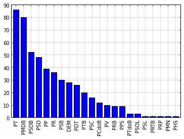
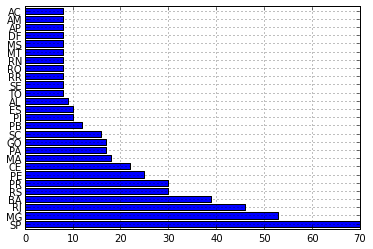
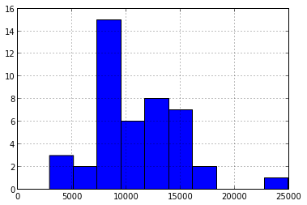
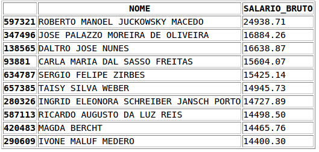

.. odbrasil documentation master file, created by
   sphinx-quickstart on Sat Jun 30 12:38:31 2012.
   You can adapt this file completely to your liking, but it should at least
   contain the root `toctree` directive.

odbrasil: Open Data Brasil
==========================

Release v\ |version|. (:ref:`installation`)

**odbrasil** is an *Apache 2.0 licensed* Python module to extract Brazilian government open data. The aim of
the project is to provide an unified, organized and well-documented API to extract and parse
(typically into `Pandas <http://pandas.pydata.org>`_ data structures) the government open data.

Today we have some projects doing scraping of the open data, but these projects doesn't offer a parse for
`Pandas <http://pandas.pydata.org>`_ and do not have an unified and organized API, most of them are
just *scripts* created in a hurry on Hackatons and do not have any documentation.

The API we're working on is simple and easy-to-use, intended not only for programmers but also for statisticians
that doesn't have a strong background development.

We **really need** the community support in order to cover a great part of the API available for the
government open data, if you want to help, join us on Github. 

I have chosen the Pandas because it is becoming the *lingua franca* of the Python data analysis toolkits and
because it is integrated with `matplotlib <http://matplotlib.sourceforge.net/>`_ and `scipy/numpy <http://docs.scipy.org/doc/>`_ ecosystem.

Usage example: legislativo.Deputados
-------------------------------------

Here is an example of what the API can do:

::

    >>> from odbrasil.legislativo import camara
    >>> api = camara.Deputados()
    >>> deputados = api.get_deputados()
    >>> deputados
    <class 'pandas.core.frame.DataFrame'>
    Int64Index: 512 entries, 0 to 511
    Data columns:
    anexo              512  non-null values
    email              512  non-null values
    fone               512  non-null values
    gabinete           512  non-null values
    idParlamentar      512  non-null values
    nome               512  non-null values
    nomeParlamentar    512  non-null values
    partido            512  non-null values
    sexo               512  non-null values
    uf                 512  non-null values
    dtypes: object(10)

    >>> vcounts = deputados.partido.value_counts()
    >>> vcounts
    PT       86
    PMDB     80
    PSDB     52
    PSD      48
    PP       39
    PR       36
    PSB      30
    DEM      28
    PDT      26
    PTB      20
    PSC      16
    PCdoB    12
    PV       10
    PRB       9
    PPS       9
    PTdoB     3
    PSOL      3
    PSL       1
    PRTB      1
    PRP       1
    PMN       1
    PHS       1
    >>> vcounts.plot(kind='bar')

::

    >>> uf_deputados = deputados.uf.value_counts()
    >>> uf_deputados.plot(kind='barh')

Usage example: monthly payments of UFRGS teachers
--------------------------------------------------

First, you have to download the CSV data called 'Servidores 2009-2012' from the
`government site <http://www.portaldatransparencia.gov.br/planilhas/>`_, unfortunatelly
this data has 44MB compressed and there is no REST API for that, so you have to download it because
it cannot be shipped together with **odbrasil** package due to its size.

::

    >>> import pandas
    >>> from odbrasil.servidores import scrap
    # This operation may take a while, it's big file to parse
    >>> dframe = pandas.read_csv('servidores.csv', sep=";")
    >>> len(dframe)
    706755
    # We have now a DataFrame with 706k rows !

    # I'm going to filter only UFRGS employees
    >>> ufrgs_lotacao = 'UNIVERSIDADE FED. DO RIO GRANDE DO SUL'
    >>> only_ufrgs = dframe[dframe.ORG_LOTACAO==ufrgs_lotacao]
    >>> len(only_ufrgs)
    6080

    # It's better now, but let's filter only teachers
    >>> professor_cargo = 'PROFESSOR 3 GRAU'
    >>> teachers = only_ufrgs[only_ufrgs.DESCRICAO_CARGO==professor_cargo]
    >>> len(teachers)
    2428

    # Let's filter now only teachers from computer science department
    >>> dep_informatica = 'DEPARTAMENTO DE INFORMATICA APLICADA'
    >>> informatica = teachers[teachers.UORG_LOTACAO==dep_informatica]
    >>> len(informatica)
    48

    # Now, let's use the odbrasil scrap functions from the Servidores module
    # to get the monthly payments of these teachers
    # The get_salario_bruto will use the name of the teacher to get his
    # monthly payment
    >>> def get_salario_bruto(nome):
    ... try:
    ...     servidor_id = scrap.get_servidor_id(nome)
    ...     salario = scrap.get_servidor_remuneracao_bruta(servidor_id)
    ...     return salario
    ... except:
    ...     return np.nan

    # And now we create a new column on the DataFrame with the new values
    >>> informatica["SALARIO_BRUTO"] = informatica["NOME"].map(get_salario_bruto)
    
    # You're free now to do data analysis using this new column data
    >>> informatica["SALARIO_BRUTO"].describe()
    count       44.000000
    mean     10683.359091
    std       4192.178186
    min       2910.380000
    25%       8023.490000
    50%      11131.690000
    75%      13381.347500
    max      24938.710000

    >>> informatica["SALARIO_BRUTO"].hist()

::
    
    >>>
    # Create a new DataFrame only with 2 columns: NOME, SALARIO_BRUTO
    >>> nome_salario = informatica[["NOME", "SALARIO_BRUTO"]]
    
    # Settings the NaNs to zero
    >>> nome_salario["SALARIO_BRUTO"] = nome_salario["SALARIO_BRUTO"].fillna(0)

    # Print the top-10
    >>> nome_salario.sort_index(by='SALARIO_BRUTO', ascending=False)[0:10]

And that's it, pretty easy don't you think ? See the API documentation and
the Pandas documentation for more information.

.. _installation:

Installation
============

You can use **pip** to install **odbrasil** module and its dependencies, it is recommended that you
have already installed scipy/numpy and matplotlib from your distro, in Ubuntu for instance:

::

    sudo apt-get install python-numpy python-scipy python-matplotlib

And to install **odbrasil**:

::

    pip install odbrasil

Simple and easy as that.

API Documentation
=================

If you are looking for information on a specific function, class or method,
this part of the documentation is for you.

.. toctree::
   :maxdepth: 4

   api

.. _license:

License
=======

   Copyright 2012 Christian S. Perone

   Licensed under the Apache License, Version 2.0 (the "License");
   you may not use this file except in compliance with the License.
   You may obtain a copy of the License at

       http://www.apache.org/licenses/LICENSE-2.0

   Unless required by applicable law or agreed to in writing, software
   distributed under the License is distributed on an "AS IS" BASIS,
   WITHOUT WARRANTIES OR CONDITIONS OF ANY KIND, either express or implied.
   See the License for the specific language governing permissions and
   limitations under the License.

Contributors
------------

Christian S. Perone `[twitter] <http://www.twitter.com/tarantulae>`_ 
`[blog] <http://pyevolve.sourceforge.net/wordpress>`_ `[github] <https://github.com/perone>`_.

